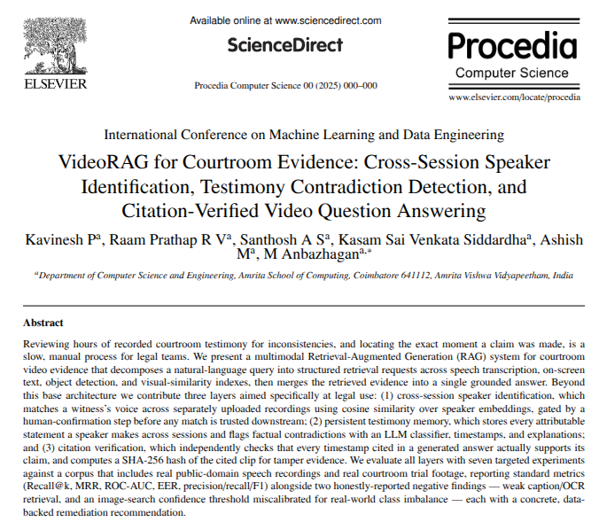

<center>

# VideoRAG



</center>


VideoRAG is a full-stack, multimodal retrieval-augmented generation system for
forensic video analysis. Investigators upload evidence videos and query them
using natural language.

Video content is processed entirely locally: speech transcripts, frame-by-frame
visual embeddings, and scene captions are all extracted on-device. An agentic
LLM (via Groq) decides which combination of these indices to search for a given
question, then returns the matching clips.

## Features

- **Multimodal video indexing** — a speech index (Whisper, timeline-synced
  dialogue), a visual similarity index (OpenCLIP, image-to-video matching), and
  a scene-context index (BLIP captioning, natural-language scene queries).
- **Agentic routing** — a Groq-hosted Llama-4 Scout 17B model uses tool-calling
  to decide which local indices to search for a given prompt, rather than
  running every index on every query.
- **Forensic UI** — a React + Vite dashboard with real-time upload progress,
  streaming LLM responses, and frame-by-frame clip viewing.
- **Local embedded database** — ChromaDB, persisted to disk. No external
  database service required.

## Technology stack

### Backend
- Framework: FastAPI + Uvicorn
- Agent/LLM: Groq API (`llama-4-scout-17b-16e-instruct`)
- Video extraction: OpenCV, imageio-ffmpeg
- Local models: openai-whisper (base/tiny), open_clip (ViT-B-32), transformers
  (BLIP image captioning)
- Vector database: ChromaDB (persistent client)

### Frontend
- Framework: React 19 + Vite
- Styling: plain CSS (CSS variables, glassmorphism aesthetic)

---

## Courtroom-evidence novelty layers

Beyond the base multimodal RAG pipeline, three novelty layers target the
specific needs of courtroom evidence review:

1. **Cross-session speaker identification.** Voiceprints extracted per session
   are matched against a case-wide speaker registry
   (`backend/services/speaker_service.py`), so the same witness is recognized
   across multiple video sessions in a case. Every auto-match is surfaced to
   the user for confirmation or correction before it's trusted downstream,
   never applied silently, via the Speakers tab of the in-app Case Panel
   (`frontend/src/components/CasePanel.jsx`), backed by
   `GET/POST /cases/{case_id}/speaker-matches`.
2. **Cross-session testimony memory and contradiction detection.** Every
   statement a confirmed speaker makes is logged to a per-case testimony
   ledger (`backend/services/testimony_db.py`). New statements are checked
   against a speaker's prior statements in the same case, and flagged
   contradictions are surfaced in the Testimony and Contradictions tabs of the
   Case Panel, backed by `GET /cases/{case_id}/testimony` and
   `/contradictions`.
3. **Citation verification.** Answers from the chat agent carry citations
   (timestamp range, speaker, source video) that are checked against the
   underlying evidence before being shown, so a claim in an answer traces back
   to an exact, verifiable clip.

## Evaluation

`evaluation/` contains a seven-part evaluation of the system, run against real
uploaded videos, including two courtroom-trial livestream recordings, rather
than simulated data: timestamp fidelity, multi-modal retrieval recall,
image-to-video search, cross-session speaker verification, contradiction
detection, citation verification, and scalability/robustness. See
[`evaluation/EVALUATION.md`](evaluation/EVALUATION.md) for methodology,
per-eval sample sizes, and results. Raw metrics are in
`evaluation/results/*.json`, figures in `evaluation/figures/*.png`.

## Paper

`paper/paper.tex` is the accompanying paper, submitted to ICMLDE
(International Conference on Machine Learning and Data Engineering), built on
the results in `evaluation/`.

---

## Getting started

### Prerequisites
- Python 3.10+
- Node.js 18+
- An NVIDIA GPU is optional but speeds up Whisper/CLIP processing
  considerably.
- A Groq API key — get one at [console.groq.com](https://console.groq.com/).

### Backend setup

```bash
cd VideoRAG
python -m venv venv
source venv/bin/activate   # Windows: venv\Scripts\activate
pip install -r backend/requirements.txt
```

If `openai-whisper` fails to install over a `pkg_resources` error, downgrade
setuptools first: `pip install "setuptools<81"`, then retry.

Set your Groq API key in `.env`:

```env
GROQ_API_KEY=your_groq_api_key_here
```

Start the backend:

```bash
python -m uvicorn backend.main:app --host 0.0.0.0 --port 8000
```

### Frontend setup

```bash
cd VideoRAG/frontend
npm install
npm run dev
```

Open `http://localhost:5173/`. The Vite dev server proxies `/api/*` requests
to `http://localhost:8000/`, so no separate CORS configuration is needed.

## Usage

1. Open the UI at `http://localhost:5173`.
2. Click "Upload Evidence" in the sidebar and select an `.mp4`, `.mov`,
   `.mkv`, or `.avi` file.
3. The system extracts audio, samples frames, embeds them with CLIP,
   transcribes speech with Whisper, and stores everything in ChromaDB.
4. Ask questions in the chat, for example:
   - "When did someone mention a weapon?"
   - "Do you see any red cars driving?"
   - "Show me frames where the suspect is walking outside."

The agent (Kubrick) retrieves the clips matching your question, with
citations back to the source video and timestamp.
