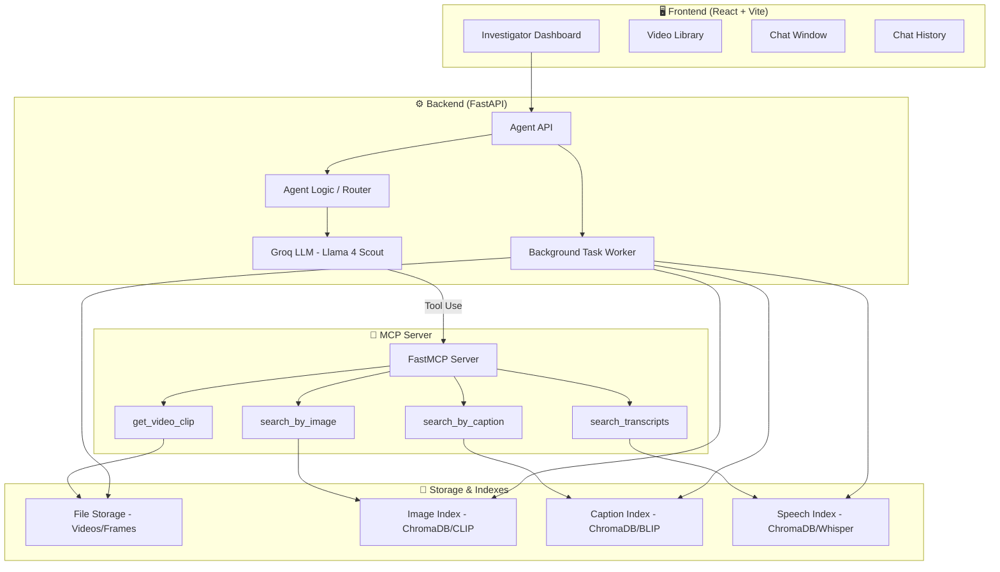
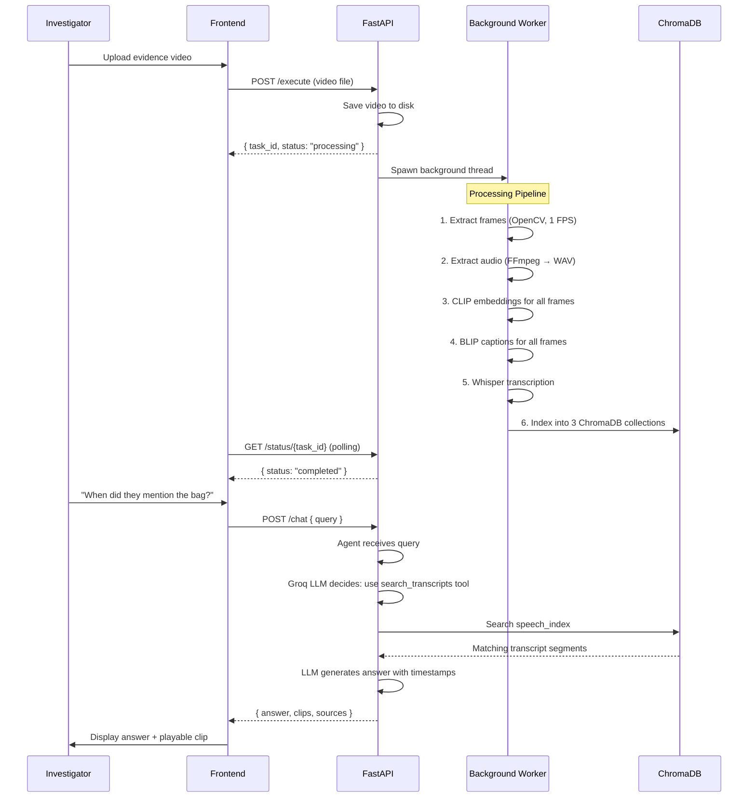

# VideoRAG — Full-Stack Implementation Plan

A multimodal Video Retrieval-Augmented Generation system for forensic evidence analysis. Investigators can upload evidence videos, and query them using natural language. The system processes videos into three searchable indexes (visual frames, scene captions, speech transcripts), and an AI agent intelligently routes queries to the right retrieval strategy.

---

## User Review Required

> [!IMPORTANT]
> **API Keys Needed**: You will need to provide the following API keys in a `.env` file:
> - `GROQ_API_KEY` — for the LLM agent (Llama-4 Scout via Groq)
> - No other paid services required — all other components run locally.

> [!WARNING]
> **Hardware Requirements**: The ML models (CLIP, BLIP, Whisper) run locally. A machine with at least **8GB RAM** is recommended. A CUDA GPU is optional but will dramatically speed up video processing. The system will auto-detect and use CPU if no GPU is available.

> [!IMPORTANT]
> **Database Choice**: This plan uses **ChromaDB** (local, file-based vector database) — **no external database setup needed**. All data is stored on disk. If you'd prefer a cloud-hosted DB (e.g., Pinecone, Supabase pgvector), let me know and I'll adjust.

---

## Architecture Overview



---

## Technology Stack

| Layer | Technology | Purpose |
|---|---|---|
| **Frontend** | React + Vite | Investigator dashboard UI |
| **Backend API** | FastAPI | REST API + WebSocket for streaming |
| **LLM** | Groq (Llama-4 Scout 17B) | Agent brain — query routing & tool use |
| **MCP Server** | `mcp` Python SDK (FastMCP) | Standardized bridge between Agent and indexes |
| **Vector DB** | ChromaDB (local, persistent) | Stores all 3 indexes on disk |
| **Image Embeddings** | OpenCLIP (ViT-B/32) | Visual frame embeddings for image search |
| **Captioning** | BLIP (Salesforce/blip-image-captioning-base) | Auto-generate scene descriptions |
| **Speech-to-Text** | Whisper (openai-whisper, base model) | Transcribe audio with timestamps |
| **Video Processing** | OpenCV + FFmpeg | Frame extraction & audio extraction |
| **Task Queue** | Threading + in-memory state | Background video processing |

---

## Databases & Storage — What You Need

> [!NOTE]
> **No external database setup required.** Everything runs locally on your machine.

| Store | Technology | What It Stores | Location |
|---|---|---|---|
| **Video Files** | Local filesystem | Uploaded raw video files | `data/videos/` |
| **Extracted Frames** | Local filesystem | Sampled frames (1 per second) | `data/frames/{video_id}/` |
| **Extracted Audio** | Local filesystem | WAV audio extracted from videos | `data/audio/{video_id}.wav` |
| **Image Index** | ChromaDB collection | CLIP embeddings of each frame | `data/chromadb/` |
| **Caption Index** | ChromaDB collection | BLIP-generated captions + embeddings | `data/chromadb/` |
| **Speech Index** | ChromaDB collection | Whisper transcript segments + embeddings | `data/chromadb/` |
| **Task State** | In-memory dict | Processing task status tracking | RAM (non-persistent) |
| **Video Metadata** | JSON files | Video info, duration, frame count | `data/metadata/{video_id}.json` |

---

## Project Structure

```
d:\VideoRAG\
├── backend/
│   ├── main.py                    # FastAPI app entry point
│   ├── config.py                  # Settings & environment variables
│   ├── models.py                  # Pydantic request/response models
│   ├── routers/
│   │   ├── execute.py             # POST /execute — upload & process video
│   │   ├── status.py              # GET /status/{task_id} — check task
│   │   ├── chat.py                # POST /chat — query the agent
│   │   └── videos.py              # GET /videos — list all videos
│   ├── services/
│   │   ├── video_processor.py     # Frame extraction, audio extraction
│   │   ├── embedding_service.py   # CLIP embeddings
│   │   ├── captioning_service.py  # BLIP captioning
│   │   ├── transcription_service.py # Whisper ASR
│   │   └── indexing_service.py    # ChromaDB index management
│   ├── agent/
│   │   ├── agent.py               # Groq-powered agent with tool routing
│   │   └── tools.py               # Tool definitions for LLM
│   ├── mcp_server/
│   │   └── server.py              # FastMCP server with search tools
│   └── requirements.txt
├── frontend/
│   ├── index.html
│   ├── package.json
│   ├── vite.config.js
│   ├── src/
│   │   ├── main.jsx
│   │   ├── App.jsx
│   │   ├── App.css
│   │   ├── index.css              # Design system
│   │   ├── components/
│   │   │   ├── Sidebar.jsx        # Video library + history
│   │   │   ├── ChatWindow.jsx     # Main chat interface
│   │   │   ├── MessageBubble.jsx  # Individual message display
│   │   │   ├── VideoPlayer.jsx    # Inline video clip player
│   │   │   ├── UploadModal.jsx    # Video upload dialog
│   │   │   └── StatusBadge.jsx    # Processing status indicator
│   │   └── api/
│   │       └── client.js          # API client functions
├── data/                          # Auto-created at runtime
│   ├── videos/
│   ├── frames/
│   ├── audio/
│   ├── metadata/
│   └── chromadb/
├── .env
├── .gitignore
└── README.md
```

---

## Proposed Changes

### Component 1: Backend Core

#### [NEW] `backend/config.py`
- Load environment variables (GROQ_API_KEY)
- Define paths for data storage directories
- ML model configuration (model names, frame sampling rate)

#### [NEW] `backend/models.py`
- Pydantic models: `ExecuteRequest`, `ExecuteResponse`, `ChatRequest`, `ChatResponse`, `VideoInfo`, `TaskStatus`, `SearchResult`, `VideoClip`

#### [NEW] `backend/main.py`
- FastAPI app with CORS middleware
- Startup event: initialize ML models, ChromaDB client, create data directories
- Mount routers for `/execute`, `/status`, `/chat`, `/videos`
- Serve static files for extracted frames

---

### Component 2: Video Processing Pipeline

#### [NEW] `backend/services/video_processor.py`
- `extract_frames(video_path, video_id, fps=1)` — Use OpenCV to sample frames at 1 FPS
- `extract_audio(video_path, video_id)` — Use FFmpeg subprocess to extract WAV audio
- `get_video_metadata(video_path)` — Duration, resolution, FPS

#### [NEW] `backend/services/embedding_service.py`
- Load OpenCLIP ViT-B/32 model once at startup
- `embed_image(image_path) -> vector` — Generate CLIP embedding for a single frame
- `embed_text(text) -> vector` — Generate CLIP embedding for a text query
- `embed_batch(image_paths) -> list[vector]` — Batch frame embedding

#### [NEW] `backend/services/captioning_service.py`
- Load BLIP model once at startup
- `caption_frame(image_path) -> str` — Generate text caption for a frame
- `caption_batch(image_paths) -> list[str]` — Batch captioning

#### [NEW] `backend/services/transcription_service.py`
- Load Whisper base model once at startup
- `transcribe_audio(audio_path) -> list[Segment]` — Transcribe with timestamps
- Each segment: `{text, start_time, end_time}`

#### [NEW] `backend/services/indexing_service.py`
- Initialize ChromaDB persistent client with 3 collections:
  - `image_index` — CLIP frame embeddings (metadata: video_id, frame_number, timestamp)
  - `caption_index` — BLIP captions as documents with sentence-transformer embeddings (metadata: video_id, frame_number, timestamp)
  - `speech_index` — Whisper transcript segments as documents (metadata: video_id, start_time, end_time)
- `index_video(video_id, frames, captions, transcripts)` — Add to all 3 indexes
- `search_images(query_embedding, n=5)` — Similarity search in image index
- `search_captions(query_text, n=5)` — Text search in caption index
- `search_transcripts(query_text, n=5)` — Text search in speech index

---

### Component 3: API Routers

#### [NEW] `backend/routers/execute.py`
```
POST /execute
  Body: { video file (multipart) }
  Response: { task_id: str, status: "processing" }
```
- Accept video upload, save to `data/videos/`
- Spawn background thread for full processing pipeline:
  1. Extract frames → `data/frames/{video_id}/`
  2. Extract audio → `data/audio/{video_id}.wav`
  3. Generate CLIP embeddings for all frames
  4. Generate BLIP captions for all frames
  5. Transcribe audio with Whisper
  6. Index everything into ChromaDB
- Track progress in global task state dict

#### [NEW] `backend/routers/status.py`
```
GET /status/{task_id}
  Response: { task_id, status: "processing"|"completed"|"failed", progress: float, message: str }
```

#### [NEW] `backend/routers/chat.py`
```
POST /chat
  Body: { query: str, video_id?: str }
  Response: { answer: str, clips: list[VideoClip], sources: list[SearchResult] }
```
- Forward query to the Agent
- Agent uses Groq LLM with tool calling to determine retrieval strategy
- Return answer with supporting video clips and source references

#### [NEW] `backend/routers/videos.py`
```
GET /videos
  Response: list[VideoInfo]  — all uploaded videos with metadata and processing status
```

---

### Component 4: Agent Logic (Groq + Tool Use)

#### [NEW] `backend/agent/tools.py`
Define tool schemas for Groq function calling:
- `search_by_caption(query: str, video_id: str | None, n: int)` — Strategy A: text-to-video via caption index
- `search_by_visual_similarity(query: str, video_id: str | None, n: int)` — Strategy A variant: text-to-video via CLIP image index
- `search_transcripts(query: str, video_id: str | None, n: int)` — Strategy C: audio/transcript search
- `get_video_clip(video_id: str, start_time: float, end_time: float)` — Extract and return specific clip info

#### [NEW] `backend/agent/agent.py`
- Initialize Groq client with `llama-4-scout-17b-16e-instruct`
- System prompt: "You are Kubrick, a forensic video analysis AI assistant..."
- Implement agentic loop:
  1. Send user query + tool definitions to Groq
  2. If LLM returns tool_calls → execute them against MCP/indexes
  3. Send tool results back to LLM
  4. LLM generates final natural language answer with clip references
- Maintain conversation history per session

---

### Component 5: MCP Server

#### [NEW] `backend/mcp_server/server.py`
- FastMCP server exposing tools as MCP protocol endpoints
- Tools mirror the agent tools but provide the actual implementation:
  - `search_by_caption` → queries ChromaDB caption_index
  - `search_by_image` → queries ChromaDB image_index
  - `search_transcripts` → queries ChromaDB speech_index
  - `get_video_clip` → returns frame paths and timestamps for a video segment
- Resources: expose video list, index statistics

> [!NOTE]
> For this initial implementation, the Agent will call the MCP tools directly (in-process) rather than over stdio/SSE. This keeps the architecture simple while maintaining the MCP interface contract. The MCP server can be deployed as a separate process later for production.

---

### Component 6: Frontend (React + Vite)

#### [NEW] `frontend/src/index.css`
- Dark theme design system with CSS variables
- Color palette: deep navy backgrounds, amber/gold accents, glass-morphism panels
- Typography: Inter font from Google Fonts
- Animations: subtle fades, slide-ins, pulse effects

#### [NEW] `frontend/src/App.jsx` + `App.css`
- Three-panel layout:
  - **Left sidebar** (280px): Video library + upload button + chat history
  - **Center** (flex): Chat window with message stream
  - **Right** (contextual): Video player when a clip is referenced
- Responsive design with collapsible sidebar

#### [NEW] `frontend/src/components/Sidebar.jsx`
- Video library panel showing uploaded videos with thumbnails
- Upload button triggering UploadModal
- Processing status indicators (spinner, progress bar, checkmark)
- Chat history list

#### [NEW] `frontend/src/components/ChatWindow.jsx`
- Message input with send button
- Message list with auto-scroll
- Support for streaming responses
- Display inline video clips in responses

#### [NEW] `frontend/src/components/MessageBubble.jsx`
- User messages (right-aligned, dark)
- AI messages (left-aligned, glass effect) with:
  - Text content
  - Embedded video clips (clickable thumbnails)
  - Source citations (which index was used)

#### [NEW] `frontend/src/components/VideoPlayer.jsx`
- Lightweight video player for clip playback
- Timestamp display
- Play/pause controls

#### [NEW] `frontend/src/components/UploadModal.jsx`
- Drag-and-drop upload zone
- Progress indicator during upload
- File type validation (mp4, avi, mov, mkv)

#### [NEW] `frontend/src/api/client.js`
- `uploadVideo(file)` → POST /execute
- `getTaskStatus(taskId)` → GET /status/{task_id} (with polling)
- `sendMessage(query, videoId?)` → POST /chat
- `getVideos()` → GET /videos
- Base URL configuration

---

## Processing Pipeline Flow



---

## Open Questions

> [!IMPORTANT]
> 1. **Groq API Key**: Do you already have a Groq API key? If not, you can get one free at [console.groq.com](https://console.groq.com).

> [!IMPORTANT]
> 2. **FFmpeg**: Is FFmpeg installed on your system and available in PATH? It's required for audio extraction from videos. If not, I'll include installation instructions.

> [!NOTE]
> 3. **GPU/CPU**: Do you have an NVIDIA GPU with CUDA? The system works on CPU but processing will be slower. This affects which Whisper model size we use (base vs tiny).

> [!NOTE]
> 4. **Image-to-Video Search (Strategy B)**: The architecture diagram shows uploading a reference image to search for visually similar frames (e.g., "Is this suspect in the footage?"). Should I implement this in the first version, or focus on text-based queries first?

---

## Verification Plan

### Automated Tests
1. **Backend startup**: `python -m uvicorn backend.main:app` — verify server starts without errors
2. **Video upload**: Upload a short test video via the API and verify frames, audio, and indexes are created
3. **Index verification**: Query each ChromaDB collection and verify data was indexed
4. **Chat test**: Send natural language queries and verify the agent returns relevant results
5. **Frontend build**: `npm run dev` in frontend/ — verify React app loads

### Manual Verification
1. Upload a short video (30-60 seconds) through the UI
2. Wait for processing to complete (watch status indicator)
3. Ask questions about the video content
4. Verify that returned clips match the query
5. Test all three retrieval strategies:
   - Text-to-video: "Show me the scene with [object]"
   - Transcript search: "When did someone say [phrase]?"
   - Visual search: "Find frames similar to [description]"
