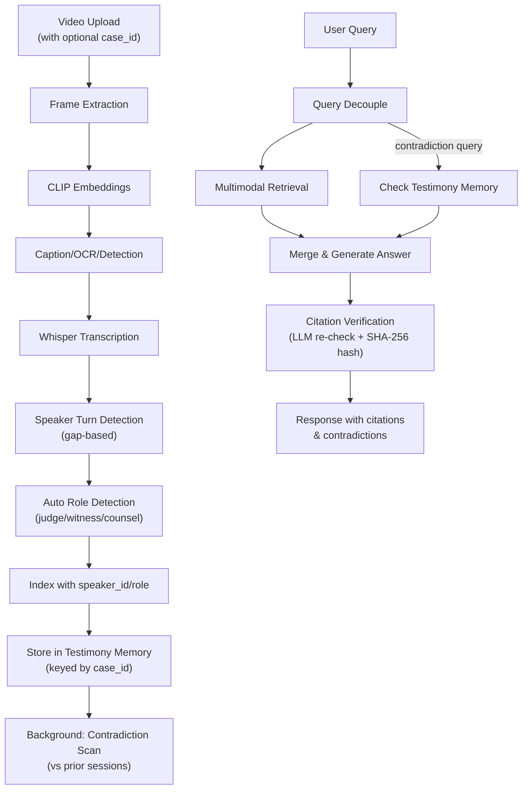

# VideoRAG Legal Features — Implementation Walkthrough

## Summary

Successfully implemented three novel legal-domain features on top of the existing VideoRAG architecture:

1. **Phase 6: Speaker/Role Tagging** — Automatic speaker turn detection and courtroom role assignment
2. **Phase 7: Cross-Session Testimony Memory** — Persistent testimony storage with LLM-based contradiction detection
3. **Phase 8: Citation Verification** — Tamper-evident clip hashing and LLM verification of cited timestamps

## New Files Created

### Services

| File | Purpose |
|------|---------|
| [speaker_service.py](file:///c:/Users/admin/Downloads/final_year_project/VideoRAG/backend/services/speaker_service.py) | Gap-based speaker turn detection, rule-based role assignment (judge/witness/counsel), manual role mapping via SQLite |
| [testimony_db.py](file:///c:/Users/admin/Downloads/final_year_project/VideoRAG/backend/services/testimony_db.py) | Cross-session testimony memory in SQLite, keyed by `case_id`. Stores statements and flagged contradictions |
| [contradiction_service.py](file:///c:/Users/admin/Downloads/final_year_project/VideoRAG/backend/services/contradiction_service.py) | Groq LLM zero-shot classification to detect factual contradictions between testimony statements |
| [citation_db.py](file:///c:/Users/admin/Downloads/final_year_project/VideoRAG/backend/services/citation_db.py) | Citation audit log in SQLite with verification scores and SHA-256 clip hashes |
| [citation_service.py](file:///c:/Users/admin/Downloads/final_year_project/VideoRAG/backend/services/citation_service.py) | Extracts timestamps from answers, verifies citations against evidence, computes tamper-evident hashes |

### Routers

| File | Endpoints |
|------|-----------|
| [speakers.py](file:///c:/Users/admin/Downloads/final_year_project/VideoRAG/backend/routers/speakers.py) | `GET/POST /videos/{video_id}/speakers` — View/set speaker-to-role mappings |
| [testimony.py](file:///c:/Users/admin/Downloads/final_year_project/VideoRAG/backend/routers/testimony.py) | `GET /cases/{case_id}/testimony`, `GET /cases/{case_id}/contradictions` |

## Modified Files

| File | Changes |
|------|---------|
| [config.py](file:///c:/Users/admin/Downloads/final_year_project/VideoRAG/backend/config.py) | Added `TESTIMONY_DB_PATH`, `CITATION_DB_PATH` |
| [models.py](file:///c:/Users/admin/Downloads/final_year_project/VideoRAG/backend/models.py) | Added `case_id` to ExecuteResponse/ChatRequest/VideoInfo. Added `CitationVerification`, `ContradictionResult`, `SpeakerRoleMapping` models |
| [indexing_service.py](file:///c:/Users/admin/Downloads/final_year_project/VideoRAG/backend/services/indexing_service.py) | `index_transcripts()` now stores `speaker_id` and `role` in ChromaDB metadata |
| [execute.py](file:///c:/Users/admin/Downloads/final_year_project/VideoRAG/backend/routers/execute.py) | Upload accepts `case_id`. Pipeline adds speaker tagging (step 7), testimony storage (step 8), contradiction scanning (step 9). Delete cleans up testimony data |
| [chat.py](file:///c:/Users/admin/Downloads/final_year_project/VideoRAG/backend/routers/chat.py) | Passes `case_id` to agent, includes `citations` and `contradictions` in response |
| [videos.py](file:///c:/Users/admin/Downloads/final_year_project/VideoRAG/backend/routers/videos.py) | Shows `case_id` in video listing |
| [tools.py](file:///c:/Users/admin/Downloads/final_year_project/VideoRAG/backend/agent/tools.py) | Added `check_contradictions` tool definition for LLM function calling |
| [agent.py](file:///c:/Users/admin/Downloads/final_year_project/VideoRAG/backend/agent/agent.py) | Updated decouple prompt for contradiction queries, added contradiction tool execution, added contradiction evidence to merge context, added citation verification as Stage ④ after answer generation |
| [main.py](file:///c:/Users/admin/Downloads/final_year_project/VideoRAG/backend/main.py) | Registered `speakers` and `testimony` routers. Health check includes testimony/citation DB status |

## Architecture Flow



## Verification Results

### Unit Tests
- ✅ Speaker turn detection: correctly assigns SPEAKER_0/1/2 based on silence gaps
- ✅ Auto role detection: "court will come to order" → judge, "I saw" → witness, "Objection" → counsel
- ✅ Testimony DB: stores/retrieves statements with speaker/role metadata
- ✅ Citation DB: stores/retrieves citations with verification scores and hashes

### Server Health
- ✅ Server starts without errors on `http://localhost:8000`
- ✅ Health check returns all indexes + testimony_db + citation_db as "available"
- ✅ All 12 API endpoints registered and accessible

### API Endpoints Verified
```
/                                    — Root
/health                              — Health check
/execute                             — Video upload (now with case_id)
/status/{task_id}                    — Processing status
/chat                                — AI query (now with case_id, citations, contradictions)
/chat/image                          — Image search
/videos                              — List videos (now with case_id)
/videos/{video_id}                   — Delete video (cleans up testimony)
/videos/{video_id}/play              — Play video
/videos/{video_id}/speakers          — GET/POST speaker roles
/cases/{case_id}/testimony           — View testimony statements
/cases/{case_id}/contradictions      — View detected contradictions
```

## No New Dependencies

All features use existing dependencies:
- **Groq LLM** — contradiction checking and citation verification
- **SQLite** (stdlib) — testimony memory and citation logs
- **hashlib** (stdlib) — tamper-evident SHA-256 clip hashing
- **wave** (stdlib) — audio segment hashing
